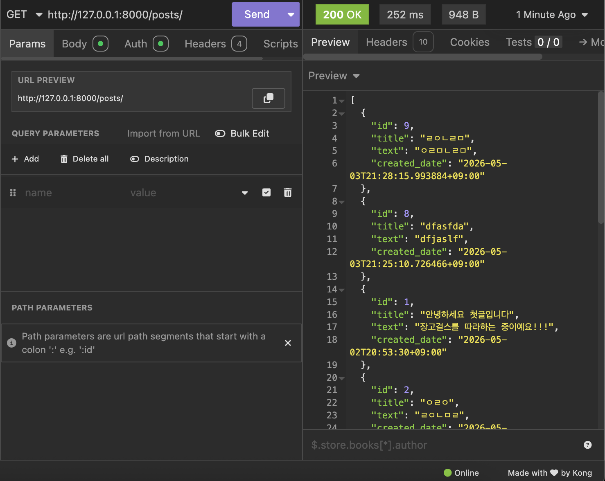

> 기존 README의 학습 기록입니다. 현재 프로젝트 안내는 [README](../README.md)에서 확인할 수 있습니다.

# 장고 REST Framework를 더 활용해보자!!

## 목표

1. 이전 진행한 장고 프로젝트에서 APIView로 구현한 부분 → GenericAPIView로 간소화 해본다.
2. GenericAPIView → ModelViewSet으로 간소화 해본다.
3. Custom action 만들어보기

## 1. APIView → GenericAPIView로 바꿔보기!!

### GenericAPIView는 뭘까?

```python
반복되는 패턴(많이 쓰는 부분)을 이미 정의해 클래스
```

### GenericAPIView에서 내가 직접 정의해줘야하는건 뭘까?

2가지 속성(Attribute)의 정의가 필요하다.

```python
queryset: DB에서 가져와서 작업할 대상(DB에서 조회된 data)
serializer_class: 대상에 적절한 직렬화 규칙
```

## serializer class는 왜 정해줘야하는걸까?

직렬화하여 JSON에 넣을수 있는 형태로 만드는것은 이해하였다. 하지만 이 과정만 필요하지 왜 여러 직렬화 클래스가 존재하는지 의문이 들었다.

```python
from rest_framework import serializers

# ArticleSerializer -> 직렬화 클래스에 따라 다른 필드값을 사용한다.
class ArticleSerializer(serializers.ModelSerializer):
    class Meta:
        model = Article
        fields = ['id', 'title', 'content']

# UserSerializer
class UserSerializer(serializers.ModelSerializer):
    class Meta:
        model = User
        fields = ['id', 'username', 'email']

# 유효성 검사, 데이터마다 다름 -> 각자의 Serializer 클래스를 따로 구현해야함
# 이전에 진행한 장고 프로젝트에도 -> 내가 정의했었던 PostSerializer, APIView에서도 필요한 직렬화 클래스를 지정한것을 확인했다.
```

기존 blog/views.py

```python
from rest_framework.views import APIView # APIView는 더이상 사용되지 않음
from rest_framework.response import Response # 기능블록에서 내부에서 처리됨
from rest_framework import status # 기능블록에 기존 상태코드는 이미 구현되어있음
from rest_framework.permissions import IsAuthenticatedOrReadOnly
from .models import Post
from .serializers import PostSerializer

# 1. 목록 조회(GET)와 생성(POST)을 담당하는 클래스
class PostList(APIView):
    permission_classes = [IsAuthenticatedOrReadOnly]  # 권한설정 변수값

    def get(self, request):
        posts = Post.objects.all().order_by("-published_date")
        serializer = PostSerializer(posts, many=True)
        return Response(serializer.data)

    def post(self, request):
        serializer = PostSerializer(data=request.data)
        if serializer.is_valid(): # 내부적으로 mixin 기능 블록에서 이미 유효성 검사를 구현되어있음
            serializer.save()
            return Response(serializer.data, status=status.HTTP_201_CREATED)
        return Response(serializer.errors, status=status.HTTP_400_BAD_REQUEST)

# 2. 상세 조회(GET), 수정(PATCH), 삭제(DELETE)를 담당하는 클래스
class PostDetail(APIView):
    permission_classes = [IsAuthenticatedOrReadOnly]

    def get_object(self, pk):
        # 객체를 가져오는 코드 따로 함수화로 단순화
        try:
            return Post.objects.get(pk=pk)
        except Post.DoesNotExist:
            return None

    def get(self, request, pk):
        post = self.get_object(pk)
        if post is None:
            return Response(status=status.HTTP_404_NOT_FOUND)
        serializer = PostSerializer(post)
        return Response(serializer.data)

    def patch(self, request, pk):
        post = self.get_object(pk)
        if post is None:
            return Response(status=status.HTTP_404_NOT_FOUND)
        serializer = PostSerializer(post, data=request.data, partial=True)
        if serializer.is_valid():
            serializer.save()
            return Response(serializer.data)
        return Response(serializer.errors, status=status.HTTP_400_BAD_REQUEST)

    def delete(self, request, pk):
        post = self.get_object(pk)
        if post is None:
            return Response(status=status.HTTP_404_NOT_FOUND)
        post.delete()
        return Response(status=status.HTTP_204_NO_CONTENT)
```

### 바꿔보자!! → mixins라는 이미 DRF가 정의한 다양한 CRUD 기능 블록을 적절히 상속 받아서 추가해주자!!

바꾼 blog/views.py

```python
from rest_framework import generics, mixins
from rest_framework.permissions import IsAuthenticatedOrReadOnly
from .models import Post
from .serializers import PostSerializer

class PostList(mixins.ListModelMixin, mixins.CreateModelMixin, generics.GenericAPIView):

    queryset = Post.objects.all().order_by("-published_date")
    serializer_class = PostSerializer
    permission_classes = [IsAuthenticatedOrReadOnly]

    def get(self, request, *args, **kwargs):
        return self.list(
            request, *args, **kwargs
        )  # ListModelMixin, mixin 기능 블록 가져다가 쓰기, many=True내부적으로 처리해줘서 단일 객체로 처리안하고 여러 리스트 객체로 처리함

    def post(self, request, *args, **kwargs):
        return self.create(request, *args, **kwargs)  # CreateModelMixin

class PostDetail(
    mixins.RetrieveModelMixin,
    mixins.UpdateModelMixin,
    mixins.DestroyModelMixin,
    generics.GenericAPIView,
):

    queryset = Post.objects.all()
    serializer_class = PostSerializer
    permission_classes = [IsAuthenticatedOrReadOnly]

    def get(self, request, *args, **kwargs):
        return self.retrieve(request, *args, **kwargs)  # RetrieveModelMixin

    def patch(self, request, *args, **kwargs):
        return self.partial_update(
            request, *args, **kwargs
        )  # partial=True로 기존 부분 수정을 유지하기 위해, UpdateModelMixin의 기능 블록의 partial_update 사용

    def delete(self, request, *args, **kwargs):
        return self.destroy(request, *args, **kwargs)  # DestroyModelMixin
```

### *args, **kwargs는 무엇일까?

```python
*agrs : 인자 개수 제한 없음(가변 인자(Variable Arguments))
**kwargs : *args에서 받은 인자, 딕셔너리 형태(key : value)로 인자와 값을 매칭
```

### get_object 코드 삭제 이유

```python
GenericAPIView 내부 : get_object()함수, 기본 내장(Built-in)으로 이미 구현되어있기 때문에 삭제해도 가능함
```

### 참고 - Slug가 무엇인가?

웹에서 slug라는 용어가 많이쓰여서 궁금하였다.

```python
PK를 사용한 URL (/posts/125/) -> 125에 무슨 내용이 있는지 알기힘듬
Slug를 사용한 URL (/posts/what-is-slug/) -> slug에 대한 설명있겠구나(라벨링? 같은 효과인듯)

# 장고 내 슬러그를 위한 필드가 따로 존재
from django.db import models

class Post(models.Model):
    title = models.CharField(max_length=100) # 제목
    slug = models.SlugField(unique=True)     # 슬러그를 위한 필드 만듬
    # 필드 값 채우는 방식, 여러 방식 존재 -> 외부라이브러리 AutoSlugField의 autoslug, 장고 내장함수 slugify, 어노테이션으로 @admin.register(Post)(Wrapper 함수?)로 제목을 쓸때 같이 생성되도록 만들기
    content = models.TextField()             # 내용
```

### 기존 urls.py는 수정해야하는가? → 수정하지 않아도 된다!!

```python
**APIView -> GenericAPIView :** 클래스 안에 def get(), def post()... 메서드가 똑같이 존재 -> 기존 urls.py 동일하게 사용가능!!
```

## 2. GenericAPIView → ModelViewSet 바꿔보기!!

### ModelViewSet이 뭘까? → CRUD 종합 블록(가져만 오면 CRUD가 구현됨), 커스텀이 안되는 단점…(이 기능 빼고 싶은데? 다른거 넣고 싶은데? → 불가능… 기성품?)

내부 구현 → 이미 mixin의 기능 블록 모두 받아 놓음 → queryset, serializer_class만 정해주면 구현 끝!!

기존 GenericAPIView (queryset + serializer_class + mixin의 함수 정해줘야했음) → ModelViewSet (queryset + serializer_class만 정해주면 됨)

```python
class ModelViewSet(mixins.CreateModelMixin,
                   mixins.RetrieveModelMixin,
                   mixins.UpdateModelMixin,
                   mixins.DestroyModelMixin,
                   mixins.ListModelMixin,
                   GenericViewSet):
```

기존 blog/views.py

```python
from rest_framework import generics, mixins # GenericAPIView는 내부적으로 사용됨, mixin도 내부적으로 상속되어 사용됨-> import 삭제
from rest_framework.permissions import IsAuthenticatedOrReadOnly
from .models import Post
from .serializers import PostSerializer

class PostList(mixins.ListModelMixin, mixins.CreateModelMixin, generics.GenericAPIView):

    queryset = Post.objects.all().order_by("-published_date")
    serializer_class = PostSerializer
    permission_classes = [IsAuthenticatedOrReadOnly]

    def get(self, request, *args, **kwargs):
        return self.list(
            request, *args, **kwargs
        )  # ListModelMixin, mixin 기능 블록 가져다가 쓰기, many=True내부적으로 처리해줘서 단일 객체로 처리안하고 여러 리스트 객체로 처리함

    def post(self, request, *args, **kwargs):
        return self.create(request, *args, **kwargs)  # CreateModelMixin

class PostDetail(
    mixins.RetrieveModelMixin,
    mixins.UpdateModelMixin,
    mixins.DestroyModelMixin,
    generics.GenericAPIView,
):

    queryset = Post.objects.all()
    serializer_class = PostSerializer
    permission_classes = [IsAuthenticatedOrReadOnly]

    def get(self, request, *args, **kwargs):
        return self.retrieve(request, *args, **kwargs)  # RetrieveModelMixin

    def patch(self, request, *args, **kwargs):
        return self.partial_update(
            request, *args, **kwargs
        )  # partial=True로 기존 부분 수정을 유지하기 위해, UpdateModelMixin의 기능 블록의 partial_update 사용

    def delete(self, request, *args, **kwargs):
        return self.destroy(request, *args, **kwargs)  # DestroyModelMixin
```

바뀐 blog/views.py

```python
from rest_framework import viewsets #ModelViewSet에 모두 정의되어있음, 상속만 받자

class PostViewSet(viewsets.ModelViewSet):
    queryset = Post.objects.all().order_by("-published_date") #정렬만 기존 list의 정렬을 유지하기위해 "-published_date" 유지
    serializer_class = PostSerializer
    permission_classes = [IsAuthenticatedOrReadOnly]
```

기존 존재하던 클래스들(PostList, PostDetail) → 하나의 클래스(PostViewSet)로 합쳐졌다.

### blog/urls.py를 바뀐 클래스에 맞게 새로 매핑해주자!!!

기존 blog/urls.py

```python
from django.urls import path
from .views import PostList, PostDetail  # APIView 클래스 가져오기

urlpatterns = [
    # 기존 post_list_create 대체, url패턴에 연결된함수 PostList.as_view() - 클래스 하위 함수를 모두 포괄한다는 뜻인듯 로 연결
    path("posts/", PostList.as_view(), name="post-list"),
    # 기존 post_detail_update_delete 대체, url패턴에 함수 연결
    path("posts/<int:pk>/", PostDetail.as_view(), name="post-detail"),
]
```

바뀐 blog/urls.py

```python
from django.urls import path, include
from rest_framework.routers import SimpleRouter
from .views import PostViewSet  # ModelViewSet 가져오기

router = SimpleRouter()  # 라우터 객체 생성

router.register(r"posts", PostViewSet)  # 라우터 객체에 ModelViewSet 등록, posts/(붙이기나름, blog도 가능)로 시작하는 URL은 모두 ModelViewSet에서 처리(매핑은 라우터가함)

urlpatterns = [
    path("", include(router.urls)),
]
```

### 참고 - SimpleRouter vs DefalutRouter

```python
DefaultRouter : 기본 최상위 메인 페이지(/, ex -> http://127.0.0.1:8000/)에 API 목록을 하이퍼링크 주소 리스트를 보여줌
SimpleRouter : 메인 페이지(/)는 만들지 않음, (ex -> /posts/, /posts/1/)만 생성
```

### 참고  - API 뷰 함수의 구현 방법들

```python
> FBV
함수 FBV(Funtion Based View) : def view(request) <- api_view 데코레이터 활용(Json data를 읽기 위함, 기존 HTML form 태그의 데이터만 읽을수 있었음(기존은 따로 로직을 개발자가 구성해줘야함))
<-> CBV(Class Based View) : class로 만든 view
> CBV
DRF APIView 상속 클래스 : class MyAPI(APIView) <- api_view 데코레이터 내부적으로, APIView만 하나 상속 -> 클래스화(상속으로 확장성 높아짐)
DRF GenericAPIView 상속 클래스 : class MyAPI(GenericAPIView, Mixins) <- mixin 기능 블록으로 추가
DRF ViewSet 상속 클래스 (Router 필요함(수동 매핑할게 너무 많음) - 기존 http 메서드 이름으로 메서드 이름(get) -> action, 즉 기능 이름으로(list(글 목록, 이것도 get임), retrive(글 상세보기, 이것도 get임)) : class MyViewSet(GenericViewSet, Mixins) <- mixin 기능 블록 추가해야함, 커스텀 가능
DRF ModelViewSet (Router 필요함) : class MyViewSet(ModelViewSet) <- mixin 다 넣음, 기성품
```

## 3. Custom action 추가해보기!!

### @action이 뭘까?

ViewSet에서, 데코레이션 @action을 활용해서 원하는 기능을 추가하는 방법이다. ← 기본 mixin이외에 만들고 싶은 기능 추가 가능

### 참고 - @action으로 커스텀 액션(기능, 메서드) 만드는법

```python
@action : serializer_class에 정해진 filed값이 아니라 model 또는 딕셔너리를 활용하면 model에 없는 필드도 사용가능

> serializer 사용 X (클래스에 serializer_class = 적힌것, 있으나 개발자가 직접 Response에 딕셔너리 넣음)
1. Response(개발자가 원하는 딕셔너리 형태로 data 반환)
> serializer 사용 O (클래스에 serializer_class = 적힌것)
1. Response(serializer.data로 반환)
> 다른 종류의 serializer 사용 (serializer = 다른 것)
1. Response(serializer.data로 반환)
```

기존 blog/views.py

```python
from rest_framework import viewsets #ModelViewSet에 모두 정의되어있음, 상속만 받자

class PostViewSet(viewsets.ModelViewSet):
    queryset = Post.objects.all().order_by("-published_date") #정렬만 기존 list의 정렬을 유지하기위해 "-published_date" 유지
    serializer_class = PostSerializer
    permission_classes = [IsAuthenticatedOrReadOnly]
```

바뀐 blog/views.py

```python
from rest_framework import viewsets  # ModelViewSet에 모두 정의되어있음, 상속만 받자
from rest_framework.permissions import IsAuthenticatedOrReadOnly
from .models import Post
from .serializers import PostSerializer
from rest_framework.decorators import action  # 데코레이터 action을 사용하기 위해
from rest_framework.response import Response  # 반환을 직접 넣어줘야함

class PostViewSet(viewsets.ModelViewSet):
    queryset = Post.objects.all().order_by(
        "-published_date"
    )  # 정렬만 기존 list의 정렬을 유지하기위해 "-published_date" 유지
    serializer_class = PostSerializer
    permission_classes = [IsAuthenticatedOrReadOnly]

    @action(detail=True, methods=["PATCH"])
    def title_change_A(
        self, request, pk=None
    ):  # 혹시 pk값 없을 경우, 프로그램의 오류 발생을 막기위함
        destination_post = self.get_object()
        destination_post.title = "A"
        destination_post.save()
        serializer = self.get_serializer(
            destination_post
        )  # 클래스의 직렬화 방법을 따름, 직렬화 해서 넘겨주기
        return Response(
            serializer.data
        )  # title만 A로 만들고 나머지는 그대로 넘겨줌, 바뀌었다는 정보를 Json으로 알려줌
```

## 4. Insomnia로 확인하기!!

서버 실행

```python
(myvenv) unknownname@hwangdaegyeom-ui-MacBookAir 장고 공부 % python manage.py runserver
```

글 목록 보기



글 생성하기


글 상세(1개)


글 수정하기(PUT)


글 수정하기(PATCH)


글 삭제하기(1개)


커스텀 action - 글 제목 “A”로 바꾸기


## 5. TIL : 2줄 코드가 작동하는 이유

```python
queryset으로 DB에서 조회된 data를 특정하여 직렬화(Json 전송을 위해)/역직렬화(코드상에서 다루기위해) 처리할 것을 찾고,
serializer_class를 지정해서 해당 data의 스키마(보안상) 특징에 맞게 적절한(필요한 속성값, 필요한 유효성(vaild) 검사) 직렬화/역직렬화 방법을 실행한다.
Router를 사용하면 라우터에 등록(register)만 해주면 라우터를 통해 한줄로 urlpatterns(장고에 등록해주기)을 추가 가능하다.
```
